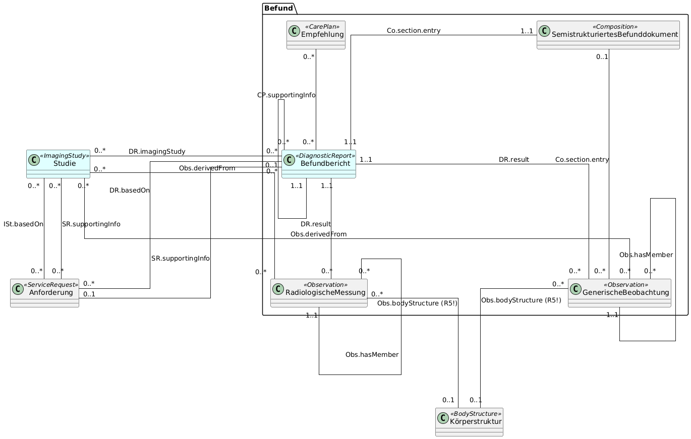

# UML-Diagramme - MII IG Kerndatensatz-Modul Bildgebung v2027.0.0-ballot

* [**Inhaltsverzeichnis**](toc.md)
* [**Anleitung**](guidance.md)
* **UML-Diagramme**

## UML-Diagramme

Als abstraktere Version eines Informationsmodells und zur besseren Verdeutlichung von Beziehungen der fachlichen Konzepte untereinander wurde aufbauend auf den Spezifikationen in ART-DECOR ein UML-Klassendiagramm erstellt. In ART-DECOR als Gruppen abgebildete Konzepte werden als eigene Klassen modelliert, die hier Assoziationsbeziehungen zueinander haben. Dieses logische Modell dient nur zur Abbildung der Datenelemente und deren Beschreibungen. Verwendete Datentypen und Kardinalitäten sind nicht als verpflichtend anzusehen. Dies wird abschließend durch die FHIR Profile festgelegt. Die Zuordnung der FHIR-Elemente zur ART-DECOR-Spezifikation wird im Kommentar-Feld im ART-DECOR beschrieben. Es wurde bewusst eine möglichst generische Abbildung der radiologischen Befundung gewählt, um hier ein breites Spektrum von Befundungsrichtlinien und -Templates abbilden zu können. Damit die Struktur leichter nachvollzogen werden kann, gibt es zusätzlich zum vollständigen UML noch zwei Abschnitte, die die Teile Metadaten und Befund gesondert betrachten.

Zur besseren Lesbarkeit des vollständigen UML findet sich dieses nochmal [als SVG](UML_Modul_Bildgebung.svg). Aus Übersichtlichkeitsgründen wurden die Referenzen auf die "Patient"-Ressource nur von den zentralen Profilen aus modelliert. Aufschluss über weitere Referenzen darauf geben die Texte innerhalb der Profile sowie die dazugehörigen FHIR-Profile.

Die abstrakte Darstellung des UMLs zeigt das UML rein auf Klassenebene mit dem Fokus auf die Assoziationsbeziehungen im Modul:

### UML Metadaten

Damit das Modul mit seinen zwei Abschnitten übersichtlicher und verständlicher bleibt, wird hier das vollständige UML nochmal unterteilt in die Abschnitte Metadaten und Befunde. In diesem Abschnitt hier wird auf das Thema Metadaten eingegangen.

Hier geht es hauptsächlich um die Erfassung der DICOM-Metadaten, die in einer FHIR ImagingStudy dargestellt werden. Ergänzt wird sie durch modalitätsspezifische Erweiterungen, die zusätzlich relevante Daten erfassen.

### UML Befund

Der Abschnitt Befund kann, je nach Datenlage, in drei verschiedenen Varianten umgesetzt werden.

#### Variante 1: vollstrukturierte Befunde

Diese Variante kann gewählt werden, wenn es vollstrukturierte Befunde in den vorhandenen Daten gibt. Beispiel wären hier die Templates der DRG.

#### Variante 2: semistrukturierte Befunde

Diese Variante kann gewählt werden, wenn es Befunde in den Daten gibt, die zum Beispiel schon in Kapitel strukturiert wurden.

#### Variante 3: Freitextbefunde

Diese Variante kann gewählt werden, wenn die Daten rein in Freitext unstrukturiert vorliegen.

