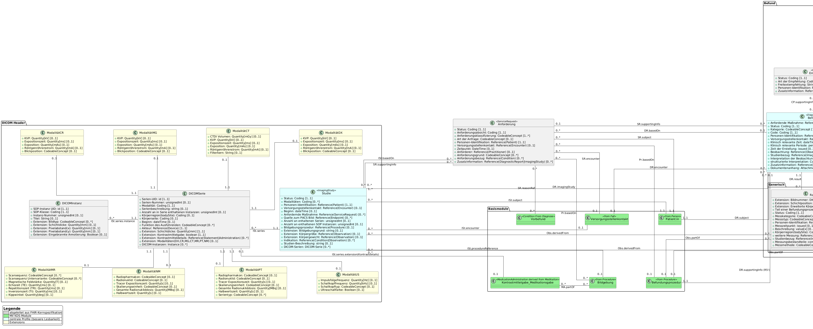
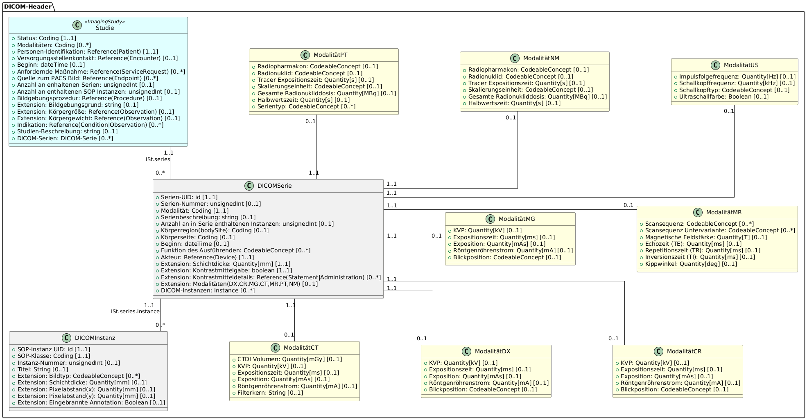
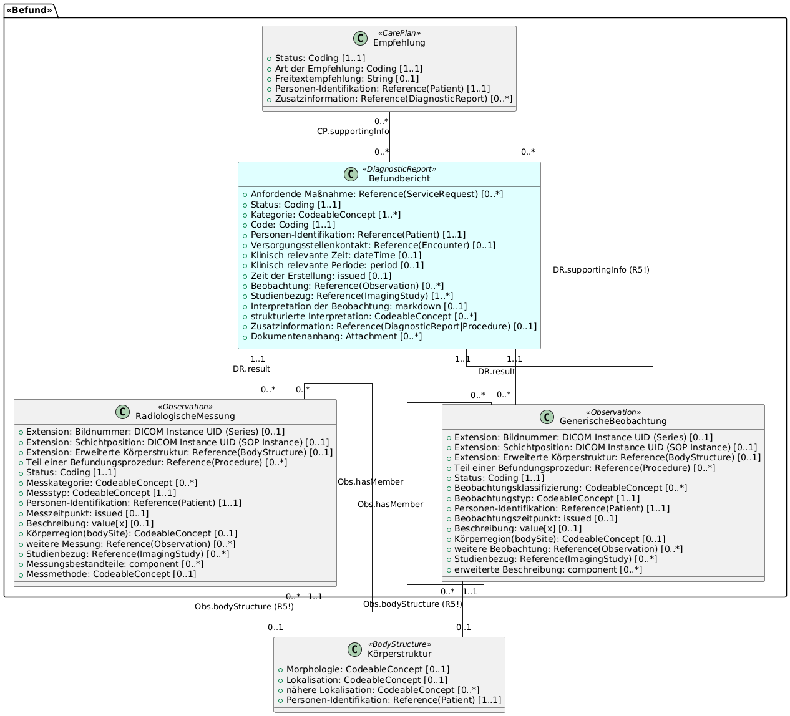
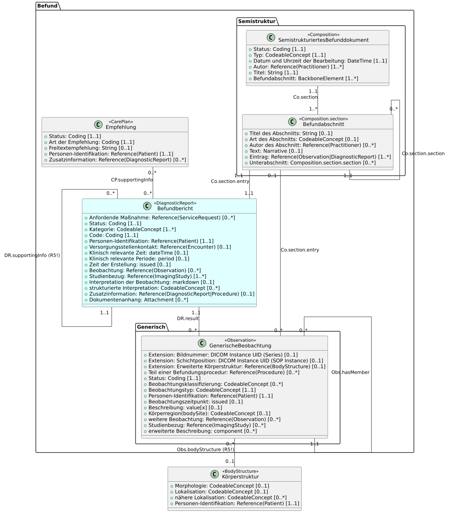
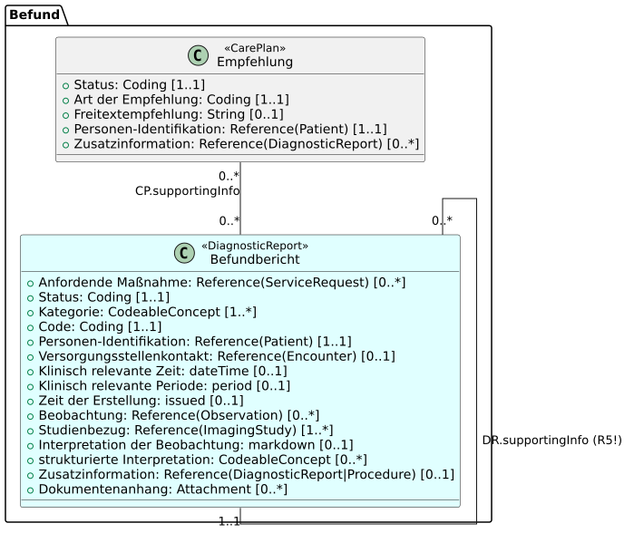

# UML Diagrams - MII IG Kerndatensatz-Modul Bildgebung v2027.0.0-ballot

* [**Table of Contents**](toc.md)
* [**Guidance**](guidance.md)
* **UML Diagrams**

## UML Diagrams

As a more abstract version of an information model, and to better illustrate the relationships between the domain concepts, a UML class diagram was created based on the specifications in ART-DECOR. Concepts represented as groups in ART-DECOR are modelled as separate classes with association relationships. This logical model serves only to represent the data elements and their descriptions. The data types and cardinalities used are not to be regarded as mandatory — they are conclusively defined by the FHIR profiles. The mapping of the FHIR elements to the ART-DECOR specification is described in the comment field in ART-DECOR. A deliberately generic representation of radiological reporting was chosen in order to be able to cover a broad spectrum of reporting guidelines and templates. To make the structure easier to follow, there are, in addition to the complete UML, two sections that look separately at the metadata and report parts.

For better readability, the complete UML is also available [as an SVG](UML_Modul_Bildgebung.svg). For clarity, the references to the "Patient" resource were modelled only from the central profiles. Further references to it are described in the texts within the profiles and in the corresponding FHIR profiles.

The abstract representation of the UML shows the model purely at class level, focusing on the association relationships in the module:

### UML metadata

To keep the module with its two sections clear and understandable, the complete UML is subdivided here into the sections metadata and report. This section deals with the metadata.

This is mainly about capturing the DICOM metadata represented in a FHIR ImagingStudy, complemented by modality-specific extensions that capture additional relevant data.

### UML report

Depending on the available data, the report section can be implemented in three different variants.

#### Variant 1: fully structured reports

This variant can be chosen when fully structured reports exist in the available data — for example the DRG templates.

#### Variant 2: semi-structured reports

This variant can be chosen when there are reports in the data that are, for example, already structured into chapters.

#### Variant 3: free-text reports

This variant can be chosen when the data exist purely as unstructured free text.

